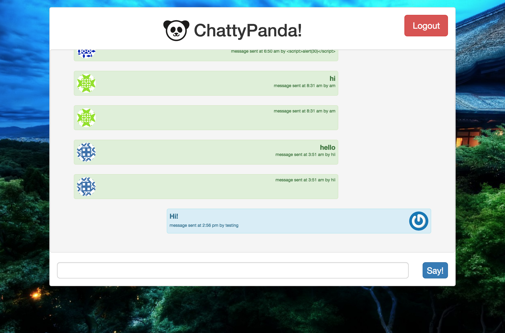

# 5.4 DRF + jQuery Chat App

A chat application using Django, Django Auth, Rest Framework, and jQuery.

--------------

## Objectives

### Learning Objectives

After completing this assignment, you should…

* Be able to create a full stack application built with jQuery and Django Rest Framework.

### Performance Objectives

After completing this assignment, you be able to effectively use

* Django Models, Views, Templates
* Django Forms
* Django Auth
* Django Rest Framework
* jQuery.ajax()
* SASS

## Details

### Deliverables

* A repo containing a django project with the following apps:
  * `account`
  * `chat`
  * `api`

* The `account` app should contain:
  * `urls.py` with django auth hooked up and routes for `signup` and `login`.
  * `views.py` with a view for signing up that uses the signup form.
  * `forms.py` with a user signup form.
  * `templates/account/login.html`
  * `templates/account/signup.html`
  
* The `chat` app should contain:
  * `urls.py` with a route configured for `/` that will load the `ChatIndex`
  * `models.py` with a `Message` model.
  * `views.py` with a `ChatIndex` view.
  * `templates/chat/base.html`
  * `templates/chat/chat.html`

* The `api` app should contain:
  * `urls.py` with a route configured for `api/message/`
  * `views.py` with a DRF viewset configured to list and create messages
  * `serializers.py` with a serializer for your `message` model

`Message` model should have the following fields:

 * User: foreignkey to user
 * Text: message text submitted by user
 * Created: Datetime field of when the record was created

### Requirements

* No JSHint warnings or errors
* pep8 and pep20 compliant
* Deployed to heroku
* Proper database migrations and postgre setup

## I'm a Full Stack Developer Mode

* I should be able to fill out a form to set my username. This should be done with a signup form.
* If I've already created an account I should be able to login with a login form.
* I should be able to create messages that are tagged with the time and my username
* I should be able to see all the messages that have been created.
* The list of messages should update with new messages without refreshing the page.
  **Hint:** use a `setInterval` to fetch your json list every 30 seconds or so.

## Hey Mikey, I Think He Likes It Mode
* I should be able to have multiple chat rooms (like Slack)
* I should be able to log in with an email address and have my Gravatar appear
* I should be able to use Markdown in my messages
* If image URLs are posted, they should become `` elements

## SCROLL DOWN FOR HINTS

...

...

...

...

...

...

...

...

...

...

...

...

### Spoilers Ahead

...

...

...

...

...

...

...

...

...

...

...

...

### Spoilers Ahead

...

...

...

...

...

...

...

...

...

...

...

...

### Spoilers Ahead

